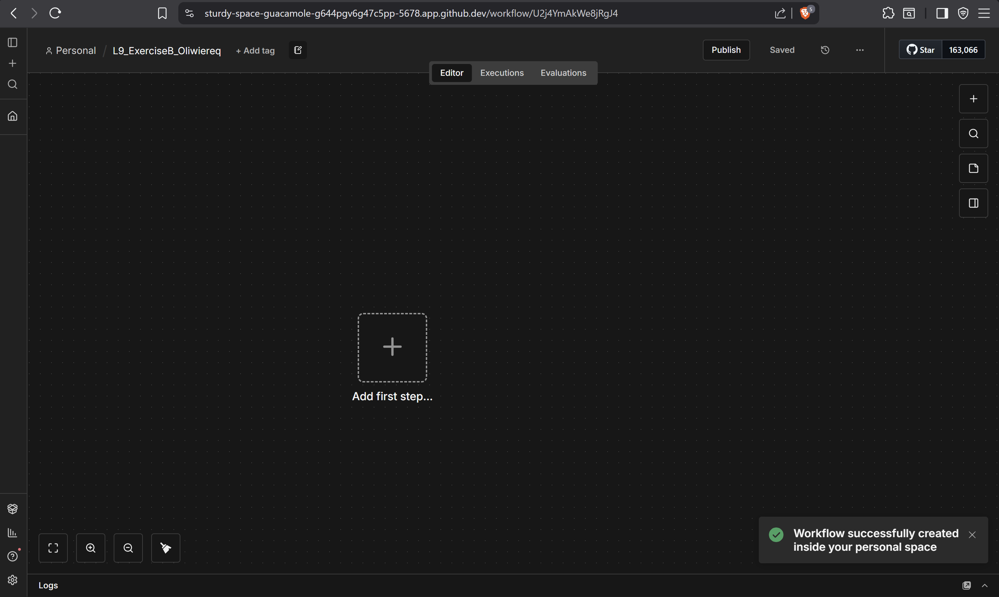
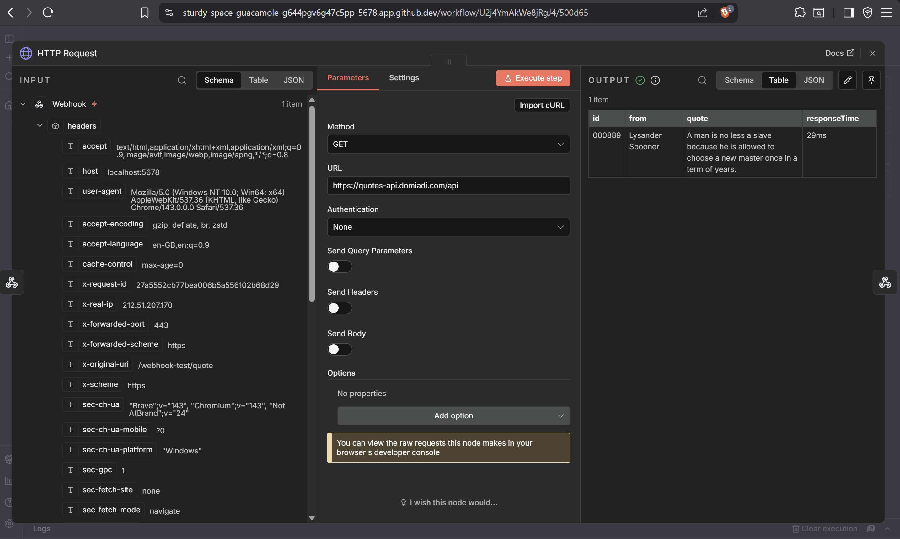
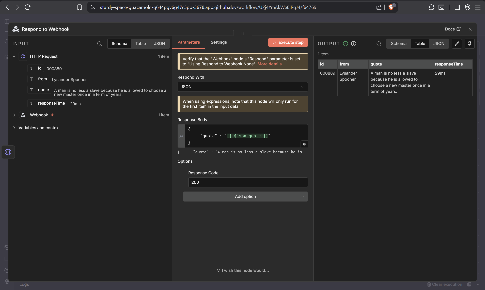
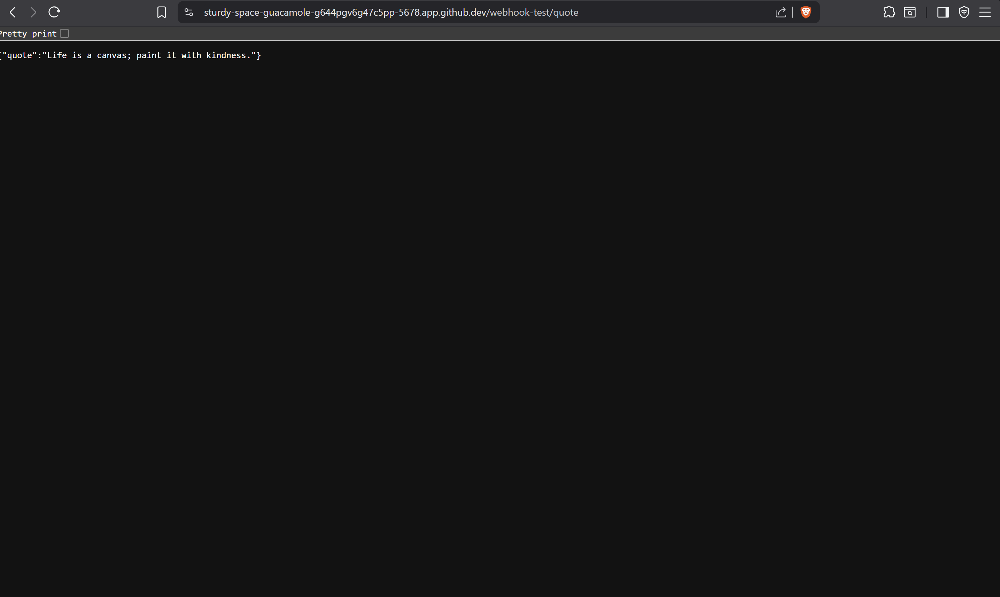

Create new workspace and edit its name

adding webhook node, acting as a trigger

adding http request node, the node issues an external API, which doesnt work. As my colleague told me, there was an error in the link, which i now fixed, so everything works fine.

adding response to webhook node, it transforms the JSON data returned by previous step into HTTP response to the original webhook

**after minor fix now it works fine**