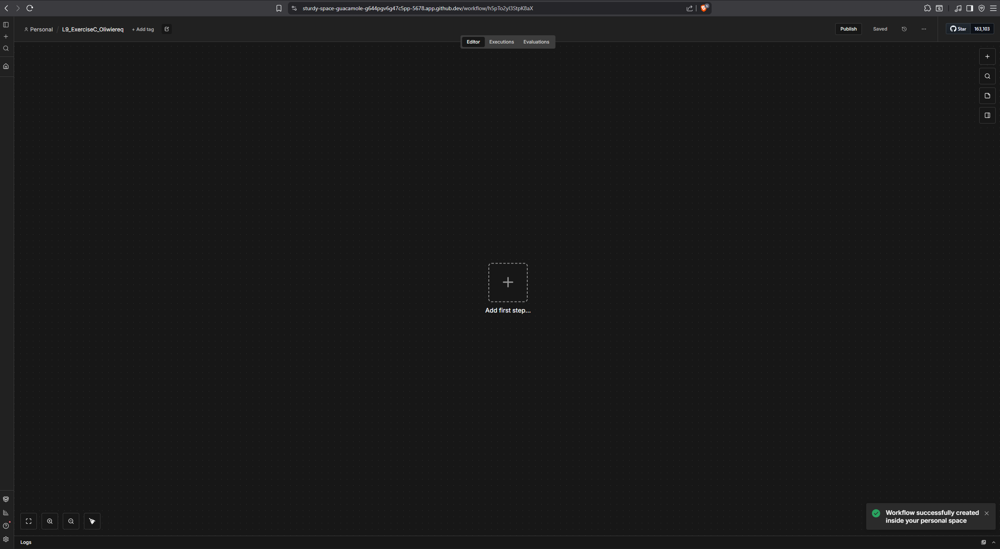
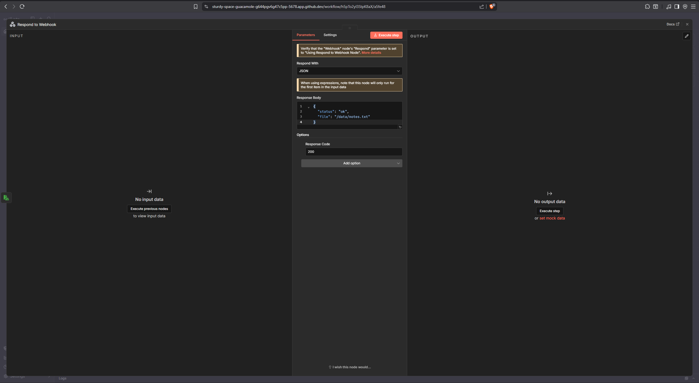

Creating new workspace and renaming it

after adding code event and writing text to a file now it's time to add a respond to a webhook trigger, which responds with a JSON.

having multiple issues with trying to save to file, n8n doesnt see the folder data ant notes.txt file. It's propably caused because it's limited to access user files in codespaces, even after granting it all the permissions. I've tried multiple fixes and nothing worked, so I'm leaving it as it is.